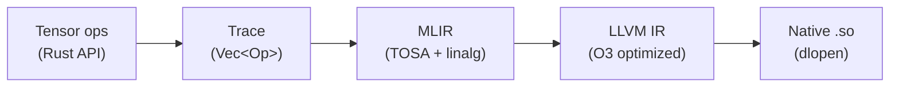
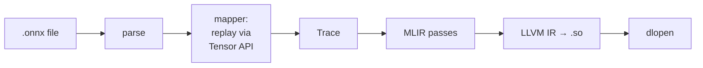

# Homura

A Rust ML inference framework that traces tensor operations, compiles them through MLIR to native shared libraries, and executes them. Runs GPT-2 end-to-end.

```rust
use homura::{Tensor, DType, Buffer, begin_trace};

begin_trace();
let a = Tensor::new(&[2, 3], DType::F32);
let b = Tensor::new(&[2, 3], DType::F32);
let c = (&a + &b).relu();

let a_buf = Buffer::from_slice::<f32>(&[1.0, -2.0, 3.0, -4.0, 5.0, -6.0], &[2, 3], DType::F32);
let b_buf = Buffer::from_slice::<f32>(&[0.5, 2.5, -1.0, 4.5, -3.0, 7.0], &[2, 3], DType::F32);
let result = c.eval(&[a_buf, b_buf]);
// [1.5, 0.5, 2.0, 0.5, 2.0, 1.0]
```

### ONNX model inference

```rust
use homura::Model;

let model = Model::load("model.onnx").unwrap();
let input = Buffer::from_slice::<f32>(&input_data, &[1, 1, 28, 28], DType::F32);
let outputs = model.run(&[&input]).unwrap();  // Vec<Buffer>
```

### CLI

```sh
homura info model.onnx                          # inspect model graph
homura run model.onnx                           # run with zero input
homura run model.onnx --input data.bin --shape 1,1,28,28
homura run tests/fixtures/ --prompt "Hello world" --max-tokens 50  # GPT-2 text generation
homura clean-cache                              # clear compiled .so cache
```

## How it works

Operations aren't executed eagerly. They're recorded into a trace — a flat list of ops — then compiled all at once into optimized native code via MLIR and LLVM.



The compiler emits [TOSA](https://mlir.llvm.org/docs/Dialects/TOSA/) dialect ops as the primary IR, with `linalg.generic` fallback for ops TOSA doesn't cover. After MLIR lowering passes, the module is translated to LLVM IR, optimized with `-O3` (using host CPU features for AVX2/SSE vectorization), and compiled to a native shared library. The `.so` is cached on disk — subsequent runs with the same model and shapes load instantly via dlopen.

For ONNX models, the `Model` API parses the protobuf, replays the graph through the tracing system, compiles, and provides a simple `load`/`run` interface. Models with symbolic dimensions (like GPT-2's `batch_size`, `sequence_length`) defer compilation to the first `run()` call, resolving shapes from actual input tensors.



See [docs/design.md](docs/design.md) for a detailed walkthrough of the architecture and compilation pipeline.

## Building

Requires LLVM 21 with MLIR C API support (`libMLIR-C.so`) and `libmlir_c_runner_utils.so`.

```sh
cargo build
```

GPT-2 model files (not in repo due to size):
```sh
./scripts/download_gpt2.sh
```

## Running

```sh
cargo run -- info tests/fixtures/mnist-12.onnx    # inspect ONNX model
cargo run -- run tests/fixtures/mnist-12.onnx     # run MNIST inference
cargo run -- run tests/fixtures/resnet18-v1-7.onnx # run ResNet-18 inference
cargo run -- run tests/fixtures/ --prompt "The meaning of life is" --max-tokens 20
cargo run -- clean-cache                          # clear compilation cache
cargo run --example onnx_mnist -- digit.png       # classify a digit image
cargo run --example add                           # element-wise add demo
cargo test                                        # ~365 tests
```

## Current status

- **Tensor ops**: Add, Sub, Mul, Div, Neg, Relu, Exp, Tanh, Pow, Sqrt, Softmax
- **Linear algebra**: Matmul (batched, any rank), Gemm (with transpose/scaling)
- **Convolution**: Conv2d (NCHW, padding/stride/dilation, auto_pad)
- **Pooling**: MaxPool2d, GlobalAvgPool
- **Normalization**: BatchNorm (composed from TOSA primitives)
- **Reductions**: ReduceSum, ReduceMax, ReduceMean (multi-axis)
- **Structural**: Reshape, Flatten, Gather, Slice, Concat, Split, Transpose, Where, Cast, Squeeze, Unsqueeze
- **Shape ops**: Constant, Shape, ConstantOfShape, Range (resolved at trace time)
- **Dtype**: F32, F64, I32, I64, Bool (mapped to I64)
- **ONNX**: 25 ops, symbolic dimensions, multiple outputs, constant folding
- **Compilation**: AOT via MLIR → LLVM IR → native .so, cached on disk
- **Tokenizer**: Byte-level BPE (GPT-2 compatible)
- **Generation**: Autoregressive text generation with greedy sampling
- **Models**: MNIST CNN, ResNet-18, GPT-2 (124M) all run end-to-end
- **Performance**: GPT-2 compiles in ~42s (cold), **2.5s** (warm cache), ~0.85s inference per forward pass

## Roadmap

**Milestone 1** (complete) — N-D tensors, matmul, broadcast, softmax. Runs a hand-coded MLP.

**Milestone 2** (complete) — TOSA backend, ONNX loading, Conv2d, MaxPool2d, BatchNorm, GlobalAvgPool. MNIST CNN and ResNet-18 run end-to-end.

**Milestone 3** (complete) — 17 new ONNX ops, symbolic dimensions, multiple outputs, batched matmul, BPE tokenizer, generation loop, AOT compilation with native .so caching. GPT-2 runs end-to-end.

**Milestone 4** (complete) — Dynamic shapes + KV cache. Two-model prefill/decode architecture. Decode model compiles once, ~0.30s/token on CPU.

**Milestone 5** (in progress) — Linalg tiling via MLIR transform dialect. Structured tiling, vectorization, and fusion of linalg ops before bufferization.

**Milestone 6** — Parallel compilation. Split monolithic function into per-layer functions for parallel LLVM compilation.

**Milestone 7** — Production-grade CPU: graph optimizations, more models (LLaMA, Mistral, Phi), quantization (int8/int4), streaming output.

**Milestone 8** — GPU backend (CUDA/Vulkan via MLIR gpu passes). Multi-GPU.

See [docs/design.md](docs/design.md) for details.
