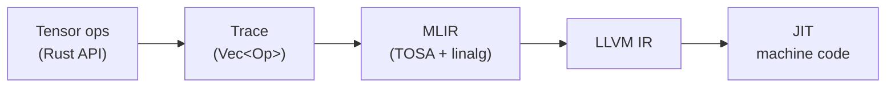
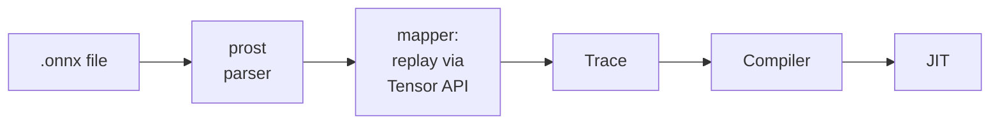

# Homura

A Rust ML inference framework that traces tensor operations, compiles them through MLIR, and JIT-executes native machine code.

```rust
use homura::{Tensor, DType, Buffer, begin_trace};

begin_trace();
let a = Tensor::new(&[2, 3], DType::F32);
let b = Tensor::new(&[2, 3], DType::F32);
let c = (&a + &b).relu();

let a_buf = Buffer::from_slice::<f32>(&[1.0, -2.0, 3.0, -4.0, 5.0, -6.0], &[2, 3], DType::F32);
let b_buf = Buffer::from_slice::<f32>(&[0.5, 2.5, -1.0, 4.5, -3.0, 7.0], &[2, 3], DType::F32);
let result = c.eval(&[a_buf, b_buf]);
// [1.5, 0.5, 2.0, 0.5, 2.0, 1.0]
```

### ONNX model inference

```rust
use homura::Model;

let model = Model::load("model.onnx").unwrap();
let input = Buffer::from_slice::<f32>(&input_data, &[1, 1, 28, 28], DType::F32);
let output = model.run(&[&input]).unwrap();
```

### CLI

```sh
homura info model.onnx                     # inspect model graph
homura run model.onnx                      # run with zero input
homura run model.onnx --input data.bin --shape 1,1,28,28  # run with data
```

## How it works

Operations aren't executed eagerly. They're recorded into a trace — a flat list of ops — then compiled all at once into optimized machine code via MLIR.



The compiler emits [TOSA](https://mlir.llvm.org/docs/Dialects/TOSA/) dialect ops as the primary IR (add, sub, mul, matmul, conv2d, reshape, etc.), with `linalg.generic` fallback for ops TOSA doesn't cover (float div, integer matmul). TOSA's well-tested lowering passes handle conversion to linalg, then bufferization and LLVM lowering produce the final machine code.

For ONNX models, the `Model` API parses the protobuf, replays the graph through the tracing system, compiles, and provides a simple `load`/`run` interface.



See [docs/design.md](docs/design.md) for a detailed walkthrough of the architecture, MLIR lowering pipeline, and JIT ABI.

## Building

Requires LLVM 21 with MLIR C API support (`libMLIR-C.so`).

Large test fixtures (e.g. `resnet18-v1-7.onnx`) are stored with [Git LFS](https://git-lfs.com/). Run `git lfs install` before cloning to fetch them automatically.

```sh
cargo build
```

## Running

```sh
cargo run -- info tests/fixtures/mnist-12.onnx    # inspect ONNX model
cargo run -- run tests/fixtures/mnist-12.onnx     # run MNIST inference
cargo run -- run tests/fixtures/resnet18-v1-7.onnx # run ResNet-18 inference
cargo run --example onnx_mnist -- digit.png       # classify a digit image
cargo run --example add                           # element-wise add demo
cargo run --example ops                           # all ops demo
cargo run --example mlp                           # hand-coded MLP
cargo test                                        # 261 tests
```

## Current status

- N-D tensors, F32/F64/I32/I64 with broadcasting
- Element-wise ops: Add, Sub, Mul, Div, Neg, Relu, Exp, Tanh
- Matmul, Gemm (general matrix multiply with transpose/scaling)
- Conv2d (NCHW layout, padding, stride, dilation)
- MaxPool2d (NCHW layout, padding, stride)
- GlobalAvgPool (NCHW, via tosa.avg_pool2d)
- BatchNorm (composed from TOSA primitives)
- Reductions: ReduceSum, ReduceMax (with keepdim)
- Reshape (with -1 dimension inference), Flatten
- Softmax (composed from reductions + exp)
- TOSA-based codegen (with linalg.generic fallback)
- ONNX model loading and inference (`Model::load` / `Model::run`)
- CLI: `homura info` / `homura run`
- MNIST CNN end-to-end (mnist-12.onnx classifies digits correctly)
- ResNet-18 end-to-end (resnet18-v1-7.onnx runs 1000-class classification)
- CPU JIT via MLIR ExecutionEngine

## Roadmap

**Milestone 1** (complete) — N-D tensors, matmul, broadcast, softmax, eval sugar. Runs a hand-coded MLP.

**Milestone 2** (complete) — TOSA backend, ONNX loading, Conv2d, MaxPool2d, BatchNorm, GlobalAvgPool. MNIST CNN and ResNet-18 run end-to-end.

**Milestone 3** — Transformer ops + compilation cache. GPT-2 on CPU with fixed seq_len.

**Milestone 4** — GPU backend (CUDA/Vulkan via MLIR gpu passes)

**Milestone 5** — Dynamic shapes + KV cache. Interactive chat speed.

**Milestone 6** — Quantization, graph optimizations, multi-model, multi-GPU

See [docs/design.md](docs/design.md) for details.
