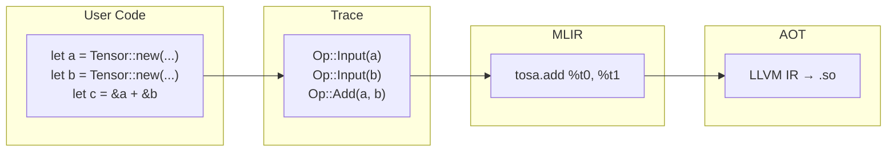
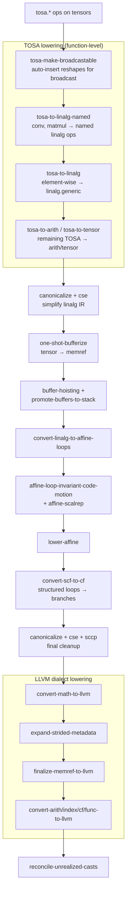
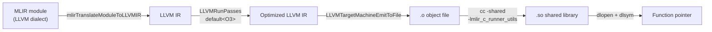
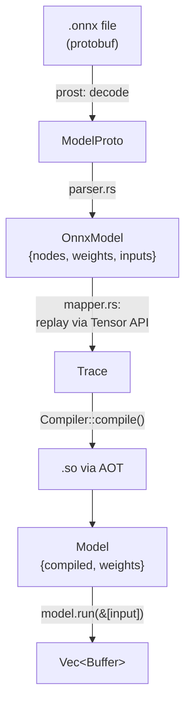
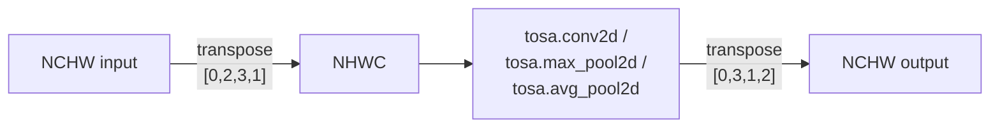

# Homura Design Document

Homura is a Rust ML inference framework that traces tensor operations into a computation graph, compiles them through MLIR to native shared libraries, and loads them via dlopen for execution.

## The Big Picture



Nothing runs until you say so. You write math, Homura writes it down, then compiles and runs it all at once.

## How It Works: Step by Step

### 1. Tracing — Recording the Recipe

When you write tensor operations, nothing computes. Homura records each operation into a flat list called a **trace**.

```rust
begin_trace();                          // open the notebook
let a = Tensor::new(&[4], DType::F32);  // write down: "input A, 4 floats"
let b = Tensor::new(&[4], DType::F32);  // write down: "input B, 4 floats"
let c = &a + &b;                        // write down: "add A + B"
let trace = take_trace();               // close the notebook
```

The trace after this looks like:

```
index 0: Input { shape: [4], dtype: F32, arg_index: 0 }
index 1: Input { shape: [4], dtype: F32, arg_index: 1 }
index 2: Add   { lhs: 0, rhs: 1, shape: [4], dtype: F32 }
```

Each entry references earlier entries by index (`NodeId`). A `Tensor` is not actual data — it's just a handle holding a `NodeId`, a `Shape`, and a `DType`.

The trace lives in a **thread-local** variable. This means:
- No context object to pass around — operations implicitly record to the active trace
- Each thread gets its own isolated trace
- Calling `begin_trace()` twice without `take_trace()` panics (one trace at a time)

### 2. Compilation — Turning the Recipe into MLIR

`Compiler::compile(trace, outputs)` walks the trace and emits MLIR intermediate representation (IR). The compiler primarily emits **TOSA dialect** ops — MLIR's Tensor Operator Set Architecture, designed for ML inference workloads.

For `c = a + b` with shape `[4]` and dtype `f32`, the generated IR is:

```mlir
func.func @compute(%arg0: memref<4xf32>,   // input a
                    %arg1: memref<4xf32>,   // input b
                    %arg2: memref<4xf32>)   // output c
    attributes { llvm.emit_c_interface } {

  %t0 = bufferization.to_tensor %arg0 restrict : memref<4xf32> to tensor<4xf32>
  %t1 = bufferization.to_tensor %arg1 restrict : memref<4xf32> to tensor<4xf32>

  %result = tosa.add %t0, %t1 : (tensor<4xf32>, tensor<4xf32>) -> tensor<4xf32>

  %out_memref = bufferization.to_buffer %result : tensor<4xf32> to memref<4xf32>
  memref.copy %out_memref, %arg2 : memref<4xf32> to memref<4xf32>
  return
}
```

Key things to notice:

- **The function takes memref arguments** (pointers to memory), not tensors. This is the ABI for the compiled shared library.
- **Internally everything is tensors.** `bufferization.to_tensor` at the boundary converts memrefs to tensors; `bufferization.to_buffer` converts back.
- **TOSA ops are high-level.** `tosa.add` says "add these tensors" without specifying loops. MLIR's lowering passes decide how to execute it.
- **linalg.generic fallback** for ops TOSA doesn't support (float division, integer matmul, gather, batched matmul).

### 3. Lowering — From High-Level IR to LLVM Dialect

The MLIR IR goes through a multi-stage pipeline that progressively lowers abstractions:



### 4. AOT Compilation — From LLVM Dialect to Native Code

After the MLIR pass pipeline produces LLVM dialect IR, the module is compiled ahead-of-time to a native shared library:



Key details:

- **Host CPU optimization**: `LLVMGetHostCPUName()` + `LLVMGetHostCPUFeatures()` enable AVX2/SSE4.2/etc. vectorization for the specific machine.
- **LLVM O3 pipeline**: `LLVMRunPasses("default<O3>")` runs the full optimization suite — loop vectorization, SLP vectorization, inlining, unrolling, dead code elimination.
- **Runner utils linking**: The `.so` is linked against `libmlir_c_runner_utils.so` (provides `memrefCopy` for padded convolution/pooling) with `-Wl,-rpath` baked in so it resolves at dlopen time.
- **Compilation cache**: The `.so` is stored in `~/.cache/homura/` keyed by hash of model bytes + input shapes + compiler fingerprint (LLVM version, homura version, CPU features). Subsequent runs with matching shapes load the cached `.so` via dlopen — near instant.

### 5. Execution — Running the Native Code

`CompiledGraph::run(inputs)` marshals Rust data into the format the compiled function expects, calls it via the dlopen'd function pointer, and extracts the results.

The native ABI uses **N-D memref descriptors** — C structs that describe a region of memory with shape and stride information. The `llvm.emit_c_interface` attribute causes MLIR to generate a C-compatible wrapper `_mlir__mlir_ciface_compute` that accepts a packed array of pointers to these descriptors. This is the symbol loaded via `dlsym`.

Multiple outputs are supported: each output gets a trailing memref argument. GPT-2 produces 25 outputs (logits + 24 KV cache tensors).

## TOSA Backend

The compiler primarily emits TOSA dialect ops. TOSA (Tensor Operator Set Architecture) is MLIR's standard op set for ML inference, with well-tested lowering passes to linalg and LLVM.

**TOSA op mapping:**

| Homura op     | MLIR approach            | Notes                                  |
|---------------|--------------------------|----------------------------------------|
| Add           | tosa.add                 |                                        |
| Sub           | tosa.sub                 |                                        |
| Mul           | tosa.mul                 | shift operand: tensor<1xi8>            |
| Neg           | tosa.negate              | zero-point operands set to 0           |
| Relu          | tosa.clamp               | min_val=0, max_val=max_float           |
| Exp           | tosa.exp                 |                                        |
| Tanh          | tosa.tanh                |                                        |
| Pow           | tosa.pow                 | FP-only, two operands                  |
| Sqrt          | linalg.generic + math.sqrt | no tosa.sqrt exists                  |
| Cast          | linalg.generic + arith   | tosa.cast has no I64 support           |
| Matmul (2D f) | tosa.matmul             | 3D only; 2D wraps with tosa.reshape    |
| Matmul (batch)| linalg.generic           | broadcast-aware affine maps for any rank |
| Matmul (int)  | linalg.generic           | tosa.matmul is float-only              |
| Gemm          | tosa.matmul + add        | optional transpose via tosa.transpose  |
| Reshape       | tosa.reshape             | target shape via tosa.const_shape      |
| Gather        | linalg.generic           | tosa.gather is 3D+I32 only             |
| Slice         | tosa.slice / linalg.generic | tosa.slice for stride=1 only        |
| Concat        | tosa.concat              | variadic inputs                        |
| Transpose     | tosa.transpose           | perms as DenseI32ArrayAttr             |
| Where         | tosa.select              | condition cast to i1 via arith.cmpi    |
| ReduceSum     | tosa.reduce_sum          | keepdim=false adds tosa.reshape        |
| ReduceMax     | tosa.reduce_max          | keepdim=false adds tosa.reshape        |
| ReduceMean    | tosa.reduce_sum + reciprocal + mul | sequential single-axis      |
| Conv2d        | tosa.conv2d              | NCHW↔NHWC transpose; pad+slice        |
| MaxPool2d     | tosa.max_pool2d          | NCHW↔NHWC; tosa.slice for floor-div   |
| GlobalAvgPool | tosa.avg_pool2d          | NCHW↔NHWC; kernel = spatial dims       |
| BatchNorm     | composed                 | sub + rsqrt + mul + add                |
| Div           | linalg.generic           | TOSA has no float div                  |

## ONNX Support

Homura can load and run ONNX models directly:



The ONNX mapper walks the graph and calls Tensor API methods, replaying the graph through homura's tracing system. A general constant folding pass evaluates ops at trace time when all inputs are known constants (enabling Shape → Gather → Unsqueeze → Concat → Reshape chains for GPT-2 attention).

**Supported ONNX ops (25):** Add, Sub, Mul, Div, Neg, Relu, Exp, Tanh, Pow, Sqrt, Cast, MatMul, Gemm, Softmax, Clip, Reshape, Flatten, Gather, Slice, Concat, Split, Transpose, Where, Conv, MaxPool, BatchNormalization, GlobalAveragePool, ReduceMean, ReduceSum, ReduceMax, Constant, Shape, ConstantOfShape, Range, Squeeze, Unsqueeze.

**Symbolic dimensions:** Models with dynamic dimensions (like GPT-2's `batch_size`, `sequence_length`) are parsed without error. Compilation is deferred to the first `run()` call, which resolves symbolic dims from actual input tensor shapes. The model auto-recompiles when input shapes change.

**Multiple outputs:** `Model::run()` returns `Vec<Buffer>`. GPT-2 produces 25 outputs (logits + 24 KV cache tensors).

**NCHW / NHWC layout handling:**

Homura uses NCHW internally (matching ONNX). TOSA spatial ops require NHWC. The compiler transposes at the boundary:



## Compilation Cache

Compiled `.so` files are cached on disk at `~/.cache/homura/` (or `HOMURA_CACHE_DIR`). The cache key is a hash of:
- Model bytes (any model change invalidates)
- Input shapes (different seq_len = different compilation)
- Compiler fingerprint: homura version, LLVM version, host CPU name + features

On cache hit, compilation is skipped entirely — the `.so` is loaded via dlopen in milliseconds. Power-of-2 bucket padding for sequence lengths limits the number of unique compilations to at most 6 (32, 64, 128, 256, 512, 1024).

`homura clean-cache` removes all cached files.

## Text Generation

For transformer models, Homura provides a generation loop:

```rust
let gen = Generator::load("tests/fixtures/").unwrap();
let text = gen.generate("The meaning of life is", 50);
```

Uses a byte-level BPE tokenizer (GPT-2 compatible, loads `vocab.json` + `merges.txt`). The generation loop does full-sequence recompute per token with greedy sampling (argmax). Each unique sequence length triggers one compilation (cached for subsequent use).

## Architecture Decisions

### AOT compilation, not JIT

The original design used MLIR's ExecutionEngine (JIT). This was replaced with ahead-of-time compilation to native `.so` files because:
- The JIT took ~33s for GPT-2 with no way to cache the result
- `dump_to_object_file` failed silently for models using `memrefCopy`
- AOT produces a standard `.so` that can be cached on disk and loaded instantly

The AOT path: MLIR → `mlirTranslateModuleToLLVMIR` → `LLVMRunPasses("default<O3>")` → `LLVMTargetMachineEmitToFile` → `cc -shared` → dlopen. Uses `llvm-sys` for LLVM C API bindings.

### Deferred tracing, not eager execution

Operations record to a trace instead of executing immediately. This lets the compiler see the entire computation graph before generating code, enabling global optimizations. The same pattern as JAX and `torch.compile`.

### Thread-local trace, not explicit context

The trace is stored in a thread-local variable rather than an explicit context object. `&a + &b` just works without passing a graph builder around.

### TOSA as primary backend, linalg.generic as fallback

TOSA provides native ops for most ML operations with well-tested lowering passes. For ops TOSA doesn't support (float div, integer matmul, gather, batched matmul, cast with I64), we fall back to `linalg.generic`.

### ONNX graph replay through Tensor API

Rather than building a separate ONNX-to-MLIR compiler, the ONNX mapper replays the graph through the existing Tensor API. This reuses shape inference, broadcasting, dtype validation, and the entire compilation pipeline.

## Source Layout

```
src/
├── lib.rs          Public API re-exports
├── dtype.rs        DType enum (F32, F64, I32, I64)
├── shape.rs        Shape wrapper over Vec<u64> with broadcast
├── main.rs         CLI: homura info / run / clean-cache
├── op.rs           NodeId and Op enum (28 variants)
├── trace.rs        Thread-local Trace context
├── tensor.rs       Tensor handle with operator overloads
├── compiler.rs     Trace → MLIR → LLVM IR → .so (AOT pipeline)
├── runtime.rs      MemRefDescriptor, Buffer, CompiledGraph (dlopen)
├── cache.rs        Disk-based .so compilation cache
├── tokenizer.rs    Byte-level BPE tokenizer (GPT-2)
├── generate.rs     Autoregressive text generation loop
├── llvm_ffi.rs     FFI for mlirTranslateModuleToLLVMIR
└── onnx/
    ├── mod.rs      Model struct (load/run), symbolic dim resolution
    ├── proto.rs    Prost-generated protobuf types
    ├── parser.rs   ONNX ModelProto → OnnxModel
    └── mapper.rs   Walk ONNX graph, replay via Tensor API, constant folding

scripts/
└── download_gpt2.sh  Download GPT-2 ONNX models + tokenizer

tests/fixtures/       MNIST, ResNet-18, GPT-2 model files + tokenizer data
```

## Dependencies

- **melior** — Rust bindings for MLIR's C API. IR construction and pass management. TOSA support via `ods-dialects` feature.
- **mlir-sys** — Low-level FFI to `libMLIR-C.so`. Patched for shared LLVM/MLIR libraries.
- **llvm-sys** — LLVM C API bindings for AOT compilation (target machine, pass builder, object emission).
- **prost** / **prost-build** — Protobuf compilation for ONNX model parsing.
- **protobuf-src** — Vendored protoc compiler.
- **clap** — CLI argument parsing.
- **libc** — dlopen/dlsym for loading compiled `.so` files.
- **serde_json** — Parsing `vocab.json` for the BPE tokenizer.
- **fancy-regex** — Pre-tokenization regex (GPT-2 BPE requires lookahead).
- Requires **LLVM 21** with `libMLIR-C.so` and `libmlir_c_runner_utils.so`.

## Current Limitations

- **CPU only** — no GPU backend
- **No KV cache feeding** — generation uses full-sequence recompute per token
- **No dynamic shapes at runtime** — shapes fixed at first `run()`, auto-recompiles on change
- **Integer division by zero** — `arith.divsi` lowers to x86 `idiv`, raises SIGFPE
- **No autograd** — forward pass only

## Roadmap

### Milestone 1: Run a hand-coded MLP (complete)

N-D tensors, matmul, broadcast, softmax, eval sugar.

### Milestone 2: Run real ONNX models (complete)

TOSA backend, ONNX parsing, Conv2d, MaxPool2d, BatchNorm, GlobalAvgPool. MNIST CNN and ResNet-18 run end-to-end.

### Milestone 3: Run GPT-2 on CPU (complete)

17 new ONNX ops, symbolic dimensions, multiple outputs, batched matmul, BPE tokenizer, generation loop, AOT compilation with native `.so` caching. GPT-2 (124M) runs end-to-end — 42s cold compile, 2.5s warm cache.

### Milestone 4: GPU backend

Swap `convert-linalg-to-loops` for GPU tiling/mapping passes. Target CUDA (`gpu-to-nvvm`) or Vulkan (`gpu-to-spirv`). GPU memory management.

### Milestone 5: Dynamic shapes + KV cache

Dynamic/symbolic dimensions in Shape, Trace, Compiler. KV cache with the `decoder_with_past_model.onnx` for incremental generation. Goal: interactive-speed token generation on GPU.

### Milestone 6: Production-grade

Quantization (int8/int4), graph optimizations (op fusion, constant folding), memory planning, multi-model support (LLaMA, Mistral, Phi), streaming output, multi-GPU.
