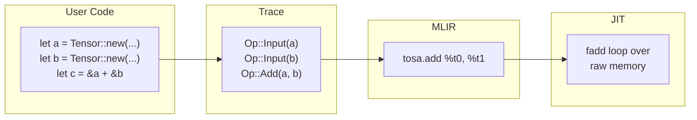
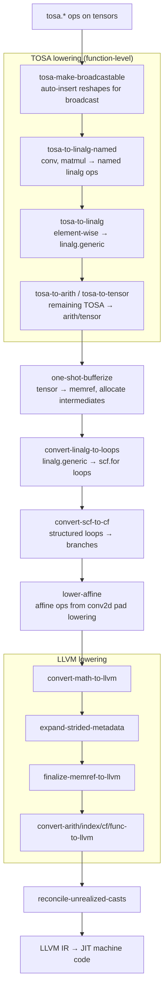
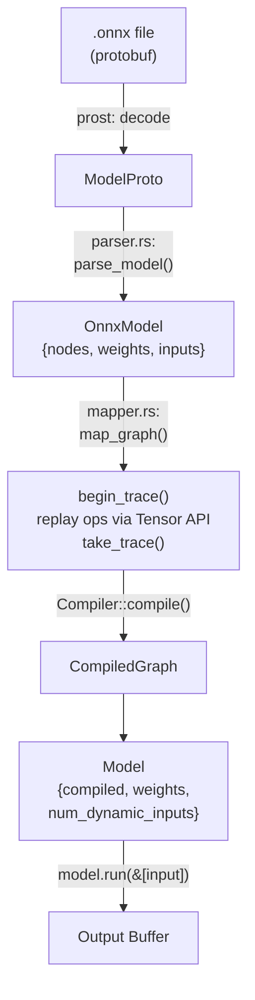
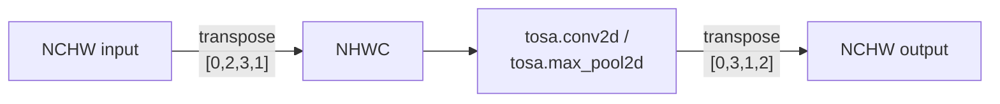

# Homura Design Document

Homura is a Rust ML inference framework that traces tensor operations into a computation graph, compiles them through MLIR, and JIT-executes the result. Think of it as a mini JAX or tinygrad in Rust.

## The Big Picture



Nothing runs until you say so. You write math, Homura writes it down, then compiles and runs it all at once.

## How It Works: Step by Step

### 1. Tracing — Recording the Recipe

When you write tensor operations, nothing computes. Homura records each operation into a flat list called a **trace**.

```rust
begin_trace();                          // open the notebook
let a = Tensor::new(&[4], DType::F32);  // write down: "input A, 4 floats"
let b = Tensor::new(&[4], DType::F32);  // write down: "input B, 4 floats"
let c = &a + &b;                        // write down: "add A + B"
let trace = take_trace();               // close the notebook
```

The trace after this looks like:

```
index 0: Input { shape: [4], dtype: F32, arg_index: 0 }
index 1: Input { shape: [4], dtype: F32, arg_index: 1 }
index 2: Add   { lhs: 0, rhs: 1, shape: [4], dtype: F32 }
```

Each entry references earlier entries by index (`NodeId`). A `Tensor` is not actual data — it's just a handle holding a `NodeId`, a `Shape`, and a `DType`.

The trace lives in a **thread-local** variable. This means:
- No context object to pass around — operations implicitly record to the active trace
- Each thread gets its own isolated trace
- Calling `begin_trace()` twice without `take_trace()` panics (one trace at a time)

### 2. Compilation — Turning the Recipe into MLIR

`Compiler::compile(trace, outputs)` walks the trace and emits MLIR intermediate representation (IR). The compiler primarily emits **TOSA dialect** ops — MLIR's Tensor Operator Set Architecture, designed for ML inference workloads.

For `c = a + b` with shape `[4]` and dtype `f32`, the generated IR is:

```mlir
func.func @compute(%arg0: memref<4xf32>,   // input a
                    %arg1: memref<4xf32>,   // input b
                    %arg2: memref<4xf32>)   // output c
    attributes { llvm.emit_c_interface } {

  // Convert memref args to tensors (boundary conversion)
  %t0 = bufferization.to_tensor %arg0 restrict : memref<4xf32> to tensor<4xf32>
  %t1 = bufferization.to_tensor %arg1 restrict : memref<4xf32> to tensor<4xf32>

  // The actual computation: TOSA add
  %result = tosa.add %t0, %t1 : (tensor<4xf32>, tensor<4xf32>) -> tensor<4xf32>

  // Convert result back to memref and copy to output argument
  %out_memref = bufferization.to_buffer %result : tensor<4xf32> to memref<4xf32>
  memref.copy %out_memref, %arg2 : memref<4xf32> to memref<4xf32>
  return
}
```

Key things to notice:

- **The function takes memref arguments** (pointers to memory), not tensors. This is the JIT calling convention.
- **Internally everything is tensors.** `bufferization.to_tensor` at the boundary converts memrefs to tensors; `bufferization.to_buffer` converts back.
- **TOSA ops are high-level.** `tosa.add` says "add these tensors" without specifying loops. MLIR's lowering passes decide how to execute it.
- **linalg.generic fallback** for ops TOSA doesn't support (float division, integer matmul).

### 3. Lowering — From High-Level IR to Machine Code

The MLIR IR goes through a multi-stage pipeline that progressively lowers abstractions:



The exact pipeline string passed to MLIR:
```
builtin.module(
    func.func(
        tosa-make-broadcastable,
        tosa-to-linalg-named,
        tosa-to-linalg,
        tosa-to-arith,
        tosa-to-tensor),
    one-shot-bufferize{
        function-boundary-type-conversion=identity-layout-map
        unknown-type-conversion=identity-layout-map},
    convert-linalg-to-loops,
    convert-scf-to-cf,
    lower-affine,
    convert-math-to-llvm,
    expand-strided-metadata,
    finalize-memref-to-llvm,
    convert-arith-to-llvm,
    convert-index-to-llvm,
    convert-cf-to-llvm,
    convert-func-to-llvm,
    reconcile-unrealized-casts)
```

TOSA passes are function-level (nested under `func.func()`). The remaining passes are module-level.

### 4. Execution — Running the Machine Code

`CompiledGraph::run(inputs)` marshals Rust data into the format the JIT-compiled function expects, calls it, and extracts the result.

The JIT ABI uses **N-D memref descriptors** — C structs that describe a region of memory with shape and stride information. The `llvm.emit_c_interface` attribute causes MLIR to generate a C-compatible wrapper that accepts pointers to these descriptors. The `invoke_packed` mechanism requires **double indirection**: each argument slot holds a pointer to a pointer to a descriptor.

## TOSA Backend

The compiler primarily emits TOSA dialect ops. TOSA (Tensor Operator Set Architecture) is MLIR's standard op set for ML inference, with well-tested lowering passes to linalg and LLVM.

**TOSA op mapping:**

| Homura op   | TOSA op              | Notes                                  |
|-------------|----------------------|----------------------------------------|
| Add         | tosa.add             |                                        |
| Sub         | tosa.sub             |                                        |
| Mul         | tosa.mul             | shift operand: `tosa.const` tensor<1xi8> |
| Neg         | tosa.negate          | zero-point operands set to 0           |
| Relu        | tosa.clamp           | min_val=0, max_val=max_float           |
| Exp         | tosa.exp             |                                        |
| Tanh        | tosa.tanh            |                                        |
| Matmul (f)  | tosa.matmul          | 3D only; 2D wraps with tosa.reshape    |
| Gemm        | tosa.matmul + add    | optional transpose via tosa.transpose  |
| Reshape     | tosa.reshape         | target shape via tosa.const_shape      |
| Conv2d      | tosa.conv2d          | NCHW↔NHWC transpose at boundary       |
| MaxPool2d   | tosa.max_pool2d      | NCHW↔NHWC; tosa.slice for floor-div   |
| ReduceSum   | tosa.reduce_sum      | keepdim=false adds tosa.reshape after  |
| ReduceMax   | tosa.reduce_max      | keepdim=false adds tosa.reshape after  |
| Div         | linalg.generic       | TOSA has no float div                  |
| Matmul (i)  | linalg.generic       | tosa.matmul is float-only              |

**LLVM 21 TOSA specifics:**

| Op             | What docs say           | What LLVM 21 requires                       |
|----------------|-------------------------|---------------------------------------------|
| `tosa.mul`     | shift is i8 attribute   | shift is 3rd operand `tensor<1xi8>`         |
| `tosa.negate`  | single operand          | 3 operands (input, input1_zp, output_zp)    |
| `tosa.clamp`   | separate fp/int attrs   | unified min_val/max_val attributes           |
| `tosa.reshape` | shape is attribute      | shape is operand via `tosa.const_shape`      |
| `tosa.slice`   | start/size as attrs     | 3 operands: input, start, size via `tosa.const_shape` |
| `tosa.conv2d`  | 3 operands              | 5 operands: input, weight, bias, input_zp, weight_zp; requires `acc_type` |
| `tosa.max_pool2d` | no `acc_type`        | requires `acc_type` attribute; strict divisibility |

## ONNX Support

Homura can load and run ONNX models directly:



The ONNX mapper walks the graph and calls Tensor API methods, replaying the graph through homura's tracing system. ONNX initializers become weight inputs; graph inputs become dynamic inputs. The `Model` struct owns the weights and prepends them to user-provided dynamic inputs at run time.

**Supported ONNX ops:** Add, Sub, Mul, Div, Neg, Relu, Exp, Tanh, MatMul, Gemm, Softmax, Clip, Reshape, Flatten, Conv (with auto_pad=SAME_UPPER), MaxPool.

**NCHW / NHWC layout handling:**

Homura uses NCHW internally (matching ONNX). TOSA spatial ops require NHWC. The compiler transposes at the boundary:



For Conv kernels: OIHW → OHWI via `tosa.transpose([0,2,3,1])`.

**MaxPool floor-division compatibility:** ONNX allows incomplete last windows (floor division). TOSA requires exact divisibility of `(H + pad - K) / stride`. The compiler adds right/bottom padding to satisfy TOSA, then `tosa.slice` to crop back to the ONNX-expected output size.

## How Chained Operations Work

For `d = (a + b) + c`, the trace records four ops and the compiler emits two TOSA add operations:

```
Trace:
  0: Input(a)
  1: Input(b)
  2: Add(0, 1)     ← a + b
  3: Input(c)
  4: Add(2, 3)     ← (a + b) + c
```

The compiler walks the trace linearly, maintaining a `NodeId → Value` map. When it hits `Add(2, 3)`, it looks up the tensor value for node 2 (the result of the first add) and node 3 (input c), then emits a second `tosa.add` that consumes the first one's output.

After TOSA lowering, bufferization, and loop conversion, this becomes two loops with an intermediate buffer. MLIR's optimization passes could potentially fuse these into a single loop.

## Architecture Decisions

### Deferred tracing, not eager execution

Operations record to a trace instead of executing immediately. This lets the compiler see the entire computation graph before generating code, enabling global optimizations. The trade-off is a two-phase API (`begin_trace/take_trace` then `compile/run`), but it's the same pattern JAX and `torch.compile` use.

### Thread-local trace, not explicit context

The trace is stored in a thread-local variable rather than an explicit context object. This keeps the API clean — `&a + &b` just works without passing a graph builder around. Each thread gets its own isolated trace.

### Flat Vec\<Op\> with NodeId indices, not a recursive tree

Operations are stored in a flat vector. Each `Op` references its inputs by `NodeId` (a `u32` index). This is more memory-efficient than `Box<Op>` trees and enforces a DAG structure (operations can only reference earlier operations). The linear layout also makes the compiler's trace walk simple.

### Memref function boundary, tensor internals

The generated function takes `memref` arguments (matching the JIT's C ABI) but uses `tensor` types internally. `bufferization.to_tensor` and `bufferization.to_buffer` convert at the boundary. This keeps the runtime ABI unchanged while letting the compiler work with high-level tensor abstractions.

### TOSA as primary backend, linalg.generic as fallback

TOSA provides native ops for most ML operations with well-tested lowering passes. For ops TOSA doesn't support (float div, integer matmul), we fall back to hand-rolled `linalg.generic`. Both paths coexist in the same module — TOSA passes are no-ops when no TOSA ops are present.

### ONNX graph replay through Tensor API

Rather than building a separate ONNX-to-MLIR compiler, the ONNX mapper replays the graph through the existing Tensor API. This reuses shape inference, broadcasting, dtype validation, and the entire compilation pipeline. The ONNX layer is a "robot user."

## Source Layout

```
src/
├── lib.rs          Public API re-exports
├── dtype.rs        DType enum (F32, F64, I32, I64) with MLIR type conversion
├── shape.rs        Shape wrapper over Vec<u64> with broadcast
├── main.rs         CLI: `homura info` (model inspector) and `homura run` (inference)
├── op.rs           NodeId and Op enum (Input, Add, Sub, Mul, Div, Neg, Relu,
│                   Exp, Tanh, Matmul, ReduceSum, ReduceMax, Reshape, Gemm,
│                   Conv2d, MaxPool2d)
├── trace.rs        Thread-local Trace context, begin_trace/take_trace/record
├── tensor.rs       Tensor handle with operator overloads, matmul, gemm, conv2d,
│                   max_pool2d, reshape, reductions, softmax, eval sugar
├── compiler.rs     Trace → MLIR IR emission (TOSA + linalg), pass pipeline,
│                   ExecutionEngine, N-D transpose helper
├── runtime.rs      N-D MemRefDescriptor, Buffer, CompiledGraph::run()
└── onnx/
    ├── mod.rs      Public API: Model struct (load/run)
    ├── proto.rs    Re-export prost-generated protobuf types
    ├── parser.rs   ONNX ModelProto → internal OnnxModel representation
    └── mapper.rs   Walk ONNX graph, replay through Tensor API

proto/
└── onnx.proto3     Vendored ONNX protobuf definition

build.rs            prost-build compilation of .proto files

examples/
├── add.rs          Element-wise add demo
├── ops.rs          All element-wise ops demo
├── mlp.rs          Hand-coded MLP demo
└── onnx_mnist.rs   MNIST digit classifier (loads image, runs model)

tests/fixtures/
├── mnist-12.onnx   Real ONNX Model Zoo MNIST CNN
└── digit7.png      Test image for end-to-end test
```

## Dependencies

- **melior** — Rust bindings for MLIR's C API. Used for all IR construction, pass management, and JIT execution. TOSA support via `ods-dialects` feature.
- **mlir-sys** — Low-level FFI bindings to `libMLIR-C.so`. Patched to support shared LLVM/MLIR libraries.
- **prost** / **prost-build** — Protobuf compilation for ONNX model parsing.
- **protobuf-src** — Vendored protoc compiler (no system dependency).
- **clap** — CLI argument parsing (`homura info` / `homura run`).
- **libc** — dlopen for `libmlir_c_runner_utils.so` (needed by conv2d pad lowering).
- **image** (dev-dependency) — Image loading for the MNIST example and e2e test.
- Requires **LLVM 21** with MLIR C API support.

## Current Limitations

- **CPU JIT only** — no GPU backend
- **Single output** — `compile()` accepts only one output node
- **Static shapes only** — no dynamic/variable dimensions
- **Integer division by zero** — `arith.divsi` lowers to x86 `idiv`, which raises SIGFPE
- **No autograd** — forward pass only, no gradient computation

## Roadmap

### Milestone 1: Run a hand-coded MLP (complete)

N-D tensors, matmul, broadcast, softmax, eval sugar.

### Milestone 2: Run real ONNX models (in progress)

TOSA backend, ONNX parsing, Gemm, Reshape, Conv2d, MaxPool2d, MNIST CNN (done). BatchNorm, GlobalAvgPool, ResNet-18 (remaining).

### Milestone 3: GPU backend

Swap `convert-linalg-to-loops` for GPU tiling passes. The TOSA/linalg IR is already GPU-ready.

### Milestone 4: Production-grade

Graph optimizations (op fusion, constant folding), dynamic shapes, autograd, memory planning, multi-device execution.
